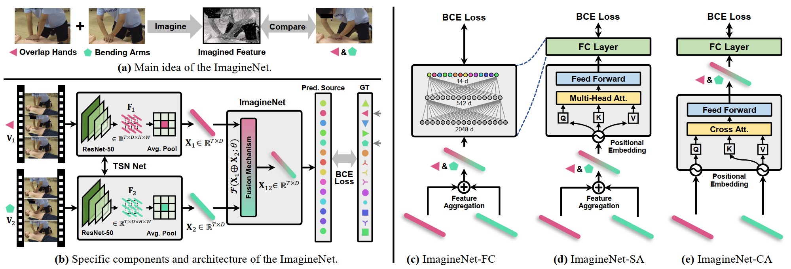

# ImagineNet
This repository contains the PyTorch implementation for __CPR-Coach: Recognizing Composite Error Actions based on Single-class Training__



Due to the size limitation of the supplementary material, we only provide ST-GCN features in this repository. 
All pre-trained models and features will be publicly available on __GitHub__.

## User Guide
The initialization process is as follows:
```bash
# 1.Create conda env.
conda create -n ImagineNet python=3.8
conda activate ImagineNet
conda install pytorch==1.12.1 torchvision==0.13.1 torchaudio==0.12.1 cudatoolkit=10.2 -c pytorch

# 2.Install python requirements.
pip install -r requirements.txt
```

After initialization, please check the repository structure:
```bash
.
├── ckpt
│   └── ST-GCN_ImagineNet_FC
│       └── ST-GCN_pre-trained.pth
├── core
│   ├── accuracy.py
│   ├── datasets
│   │   ├── dataset_ImagineNet_CA.py
│   │   ├── dataset_ImagineNet_FC.py
│   │   └── dataset_ImagineNet_SA.py
│   └── models
│       ├── ImagineNet_CA.py
│       ├── ImagineNet_FC.py
│       └── ImagineNet_SA.py
├── pkl
│   ├── Double_STGCN.pkl
│   └── Single_STGCN.pkl
├── eval_ImagineNet_CA.py
├── eval_ImagineNet_FC.py
├── eval_ImagineNet_SA.py
├── requirements.txt
├── README.md
├── train_ImagineNet_CA.py
├── train_ImagineNet_FC.py
└── train_ImagineNet_SA.py
```

## Training & Testing
Run the next command to train and evaluate the ImagineNet-FC on ST-GCN features.
```python
python train_ImagineNet_FC.py
```
Running results:
```python
epoch: 05, lr: 0.001000, loss: 0.105031 mAP: 0.6430, mmit_mAP: 0.7167
epoch: 10, lr: 0.001000, loss: 0.065661 mAP: 0.6451, mmit_mAP: 0.7180
epoch: 15, lr: 0.001000, loss: 0.039726 mAP: 0.6453, mmit_mAP: 0.7165
epoch: 20, lr: 0.000100, loss: 0.100471 mAP: 0.6451, mmit_mAP: 0.7150
epoch: 25, lr: 0.000100, loss: 0.043471 mAP: 0.6448, mmit_mAP: 0.7161
epoch: 30, lr: 0.000100, loss: 0.052397 mAP: 0.6444, mmit_mAP: 0.7153
epoch: 35, lr: 0.000100, loss: 0.025886 mAP: 0.6448, mmit_mAP: 0.7164
epoch: 40, lr: 0.000010, loss: 0.022479 mAP: 0.6446, mmit_mAP: 0.7149
epoch: 45, lr: 0.000010, loss: 0.021889 mAP: 0.6446, mmit_mAP: 0.7162
epoch: 50, lr: 0.000010, loss: 0.064570 mAP: 0.6447, mmit_mAP: 0.7165
epoch: 55, lr: 0.000010, loss: 0.010635 mAP: 0.6447, mmit_mAP: 0.7160
epoch: 60, lr: 0.000010, loss: 0.043592 mAP: 0.6448, mmit_mAP: 0.7161
```
Evaluate the ImagineNet-FC by pre-trained weights.
```bash
python eval_ImagineNet_FC.py
```
Running results:
```python
mAP: 0.6448, mmit_mAP: 0.7161
```

We cannot provide more features generated through TSN, TSM, I3D and other networks due to size constraints of the supplementary material.

Please pay attention to the subsequent code and dataset release.
